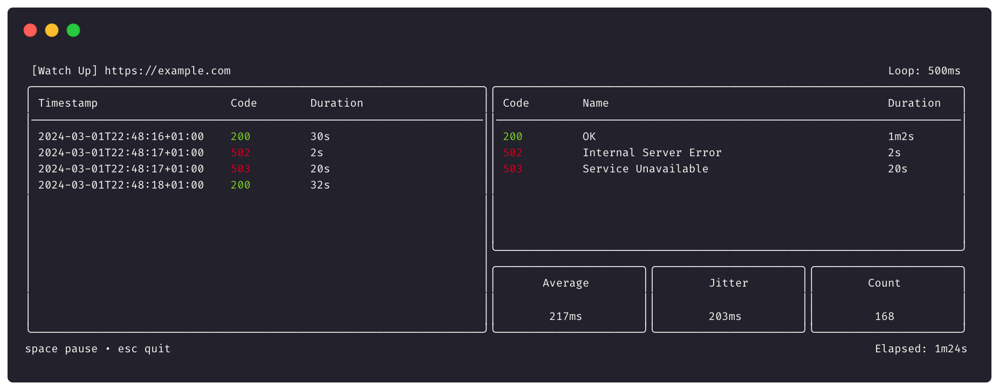

# watch-up


[](https://github.com/NoUseFreak/watch-up/releases)
[](https://github.com/NoUseFreak/watch-up/actions/workflows/ci.yml)
[](http://www.go.dev)


> Watch-up is a simple url monitoring tool that checks if a website is up or down.



## Installation

```sh
go install github.com/nousefreak/watch-up/cmd/watch-up@latest
```

## Usage

```sh
watch-up https://httpstat.us/Random/200,500
```

